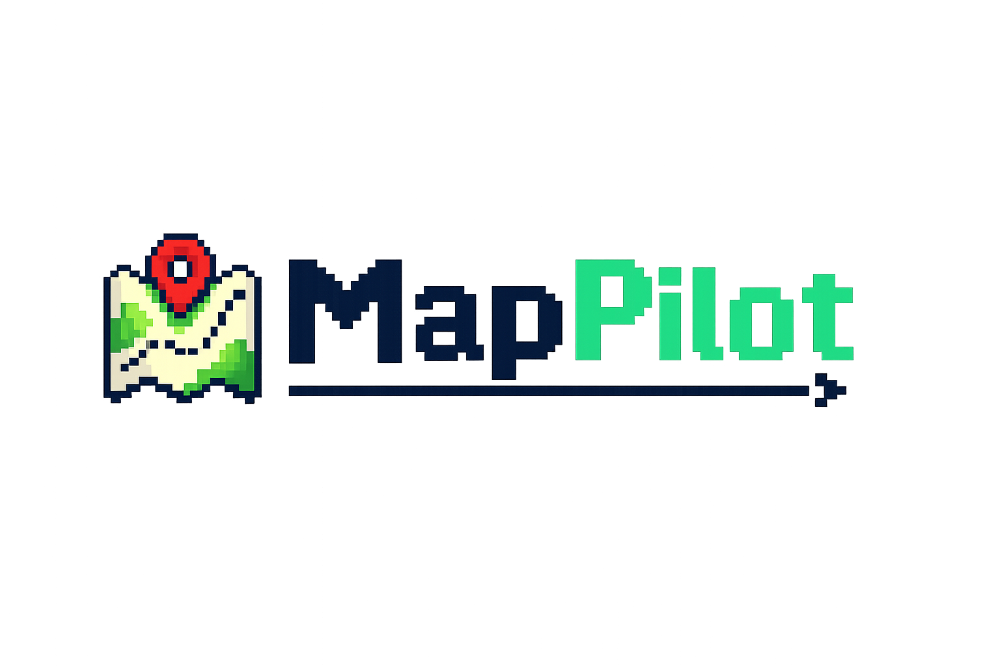

<p align="center">
  
</p>

# MapPilot (灵途)

[](https://docs.ros.org/en/humble/)
[](https://developer.nvidia.com/embedded/jetson-orin)
[](LICENSE)

Autonomous navigation system for quadruped robots in outdoor and off-road environments. Runs on ROS 2 Humble. Supports SLAM-based mapping, terrain-aware path planning, and semantic navigation via natural language instructions.

---

## Hardware

| Component | Specification | Required |
|-----------|--------------|----------|
| LiDAR | Livox MID-360 | Yes |
| RGB-D Camera | Orbbec Gemini 330 | No |
| Compute | Jetson Orin NX 16GB | Recommended |
| OS | Ubuntu 22.04 | Yes |

Dual-board architecture: Nav Board runs navigation software (SLAM, planning, perception, gRPC); Dog Board runs the motion control RL policy and motor drivers. They communicate over Ethernet — Nav Board sends velocity commands, Dog Board executes them.

## Build

```bash
source /opt/ros/humble/setup.bash
colcon build --cmake-args -DCMAKE_BUILD_TYPE=Release
source install/setup.bash
```

Full build including OTA daemon and PCT planner C++ core:

```bash
./build_all.sh
```

## CLI — `python lingtu.py`

Single entry point for launching profiles and inspecting running instances.

```bash
python lingtu.py                     # interactive profile picker
python lingtu.py --list              # list available profiles
python lingtu.py --version           # print version and exit
python lingtu.py stub                # no hardware, framework testing
python lingtu.py dev                 # semantic pipeline, no C++ nodes
python lingtu.py sim                 # MuJoCo simulation
python lingtu.py map                 # SLAM mapping mode
python lingtu.py nav                 # navigate using a saved map
python lingtu.py explore             # exploration, no pre-built map
python lingtu.py nav --llm mock      # override any profile flag
python lingtu.py nav --daemon        # background daemon (Unix)
```

### Lifecycle commands

```bash
python lingtu.py status              # running instance status
python lingtu.py status --json       # machine-readable (pipe into jq)
python lingtu.py log                 # print the current run log
python lingtu.py log -f              # follow (tail -f)
python lingtu.py log --lines 200     # last 200 lines
python lingtu.py show-config nav     # print resolved config
python lingtu.py show-config nav --json
python lingtu.py stop                # graceful stop (SIGTERM)
python lingtu.py stop --force        # SIGKILL
python lingtu.py restart             # stop + relaunch with the same argv
python lingtu.py doctor              # diagnostics
python lingtu.py rerun               # launch Rerun 3D viewer
```

`lingtu status` shows PID, host, profile, uptime, module/wire count, log
location, and live status (`running` / `stopping` / stale). `--json` emits the
full state dict for scripting.

## Operation Modes

**Mapping** — Drive the robot manually while SLAM builds a map.

```bash
python lingtu.py map        # recommended
./mapping.sh                # legacy shell launcher
./save_map.sh               # save map when done
```

**Navigation** — Load an existing map and navigate autonomously to a goal.

```bash
python lingtu.py nav        # recommended
./planning.sh               # legacy shell launcher
```

**Exploration** — Navigate in an unknown environment without a pre-built map. Supports natural language goal specification.

```bash
python lingtu.py explore
ros2 launch launch/navigation_explore.launch.py target:="找到餐桌"
```

## Architecture

```
Livox LiDAR --> Fast-LIO2 (SLAM) --> Terrain Analysis --> PCT Planner --> Dog Board
                      |                                         |
                 ICP Localizer                          Local Planner
                      |
            Orbbec RGB-D Camera
                      |
              YOLO-World + CLIP
                      |
           ConceptGraphs Scene Graph
                      |
         Semantic Planner (Fast-Slow)  <-- Natural language instruction
                      |
               gRPC Gateway (50051) --> Flutter Client
```

**SLAM**: Fast-LIO2 frontend with pose graph optimization (PGO) loop closure. ICP-based relocalization against a saved map.

**Terrain Analysis**: Point cloud ground estimation, traversability scoring, slope-weighted cost generation.

**Global Planning**: PCT planner (tomography-based) with A\* search. Catmull-Rom path smoothing. Waypoint tracking with stuck detection and progressive recovery.

**Semantic Navigation**: Fast path (~0.17 ms) uses keyword and spatial matching against the scene graph. Slow path (~2 s) uses LLM reasoning with ESCA selective grounding. AdaNav entropy trigger escalates from fast to slow when confidence is low. LERa failure recovery handles repeated subgoal failures.

**Remote Monitoring**: gRPC server on port 50051. Flutter client (Android, Windows, iOS) for telemetry, manual control, and OTA updates.

## Platform Boundary

`lingtu` is the robot autonomy provider for the NOVA Dog platform. It owns:

- ROS2 navigation and localization
- semantic perception and scene graph construction
- provider-side task execution
- provider-side gRPC telemetry and data streams

`lingtu` is not the operator-facing runtime and should not be treated as the
top-level product control plane.

For the product boundary:

- `nav` wraps `lingtu` navigation as a product service
- `sense` wraps `lingtu` perception outputs as product-readable scene truth
- `voice` and `askme` stay on the operator interaction side
- `arbiter`, `safety`, and `control` own mission, safety, and actuation policy

See
[`products/nova-dog/runtime/docs/ASKME_LINGTU_DECOUPLING.md`](/D:/inovxio/products/nova-dog/runtime/docs/ASKME_LINGTU_DECOUPLING.md)
for the cross-project decoupling design.

## Source Layout

```
src/
  slam/                    Fast-LIO2, PGO, ICP localizer
  base_autonomy/           Terrain analysis, local planner
  global_planning/         PCT planner, path adapter
  semantic_perception/     YOLO-World, CLIP, ConceptGraphs scene graph
  semantic_planner/        Fast-Slow planner, frontier exploration, LLM client
  remote_monitoring/       gRPC gateway, OTA service, WebRTC bridge
  nav_core/                Header-only C++ core (platform-independent)
  ota_daemon/              OTA update daemon (independent CMake build)
  drivers/                 Livox LiDAR driver, quadruped serial interface

client/
  flutter_monitor/         Flutter cross-platform client application

config/                    YAML configuration files
launch/                    ROS 2 launch files (mapping, navigation, exploration)
systemd/                   Systemd service units for bare-metal deployment
scripts/                   Build, deploy, health check, OTA utilities
```

## Configuration

Key configuration files:

| File | Purpose |
|------|---------|
| `config/robot_config.yaml` | Robot geometry, speed limits, safety parameters |
| `config/semantic_planner.yaml` | LLM backend, goal resolution, frontier scoring weights |
| `config/topic_contract.yaml` | ROS 2 topic name definitions |
| `config/semantic_exploration.yaml` | Exploration mode overrides |

LLM backends (set via environment variable):

```bash
export MOONSHOT_API_KEY="..."       # Kimi — default, China-accessible
export DASHSCOPE_API_KEY="..."      # Qwen — fallback
export OPENAI_API_KEY="sk-..."      # OpenAI
export ANTHROPIC_API_KEY="sk-ant-..." # Claude
```

## Testing

```bash
make test                          # All colcon unit tests
make test-integration              # Integration tests (requires ROS 2 build)

# Planning unit tests — no ROS 2 required
python tests/planning/test_pct_adapter_logic.py

# Single test file
cd src/semantic_planner && python -m pytest test/test_goal_resolver.py -v
```

## Deployment

**Docker**

```bash
make docker-build
make docker-run     # docker-compose up -d
```

**Bare-metal (systemd)**

```bash
make install        # Install systemd service units
```

Seven service units: `nav-lidar`, `nav-slam`, `nav-autonomy`, `nav-planning`, `nav-grpc`, `nav-semantic`, `ota-daemon`.

**OTA**

```bash
scripts/ota/build_nav_package.sh   # Build update package
scripts/ota/deploy_to_robot.sh     # One-click deploy to robot
```

## Documentation

| Document | Description |
|----------|-------------|
| `docs/AGENTS.md` | ROS 2 topic and node map, startup sequence |
| `docs/02-architecture/` | System architecture, topic contract |
| `docs/03-development/` | API reference, parameter tuning, troubleshooting |
| `docs/04-deployment/` | Docker and OTA deployment guides |
| `docs/06-semantic-nav/` | Semantic navigation design and implementation |

## License

MIT License. See [LICENSE](LICENSE).
