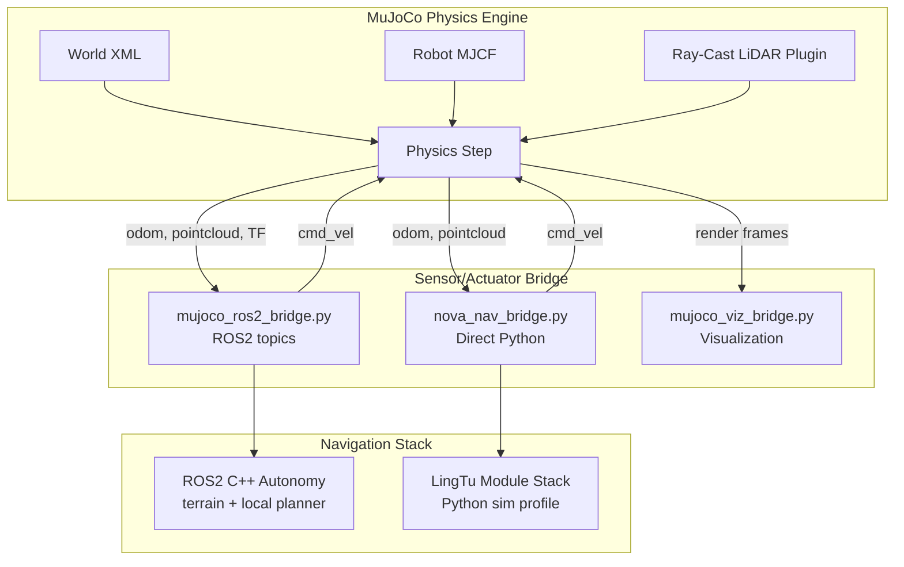
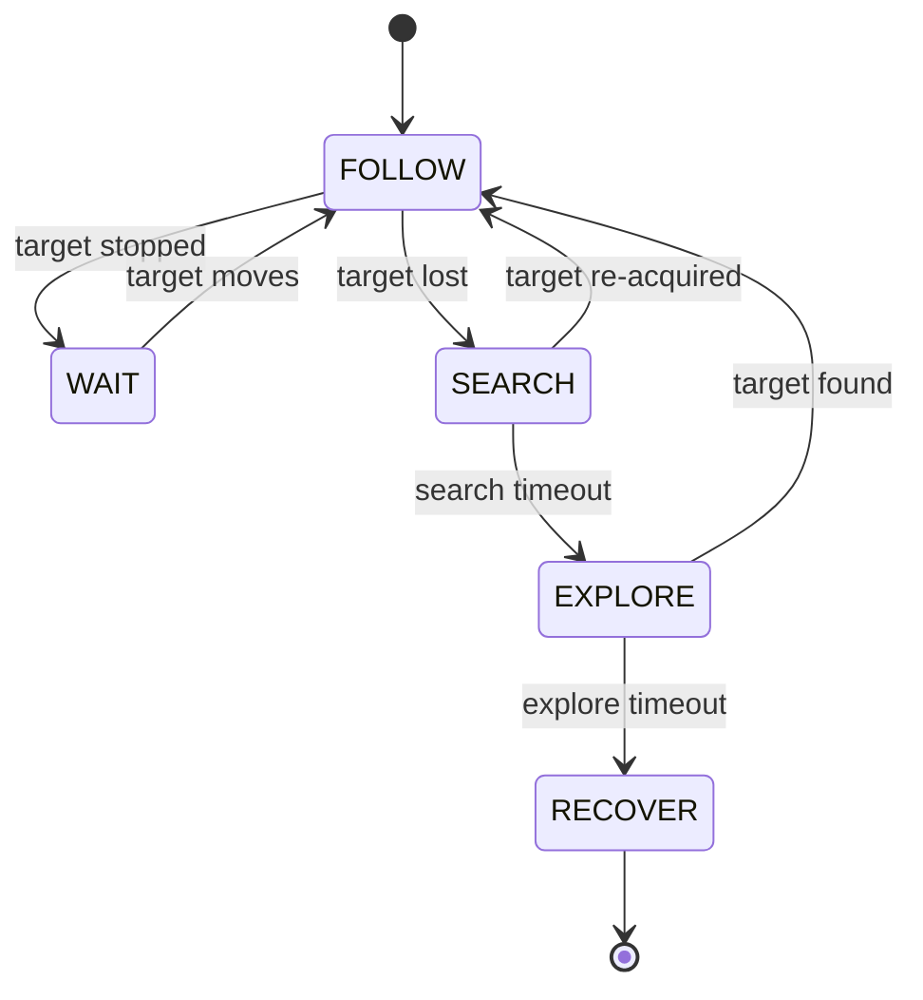

# LingTu Simulation Environment

> A hardware-free, full-stack simulation framework for quadruped robot navigation. Built on MuJoCo physics with ray-cast LiDAR, it enables end-to-end testing of SLAM, terrain-aware planning, semantic navigation, and person-following — all without a physical robot.

## 1. Overview

The simulation environment mirrors the real-world LingTu deployment stack while replacing hardware sensors and actuators with physics-accurate MuJoCo models. This enables rapid iteration on navigation algorithms, regression testing, and data collection for learning-based methods.

**Supported capabilities:**

- Full 6-DOF rigid body dynamics with contact
- Ray-cast LiDAR simulation (Livox Mid-360 pattern, 360° FoV)
- RGB-D camera rendering
- Person-following behavioral simulation with FSM control
- Semantic search and exploration
- Direct integration with both ROS2 and pure-Python LingTu stacks

## 2. System Architecture



The architecture is intentionally modular. Worlds, robots, and bridges are independent — any world can host any robot, and either bridge connects to the navigation stack.

## 3. Scenes

Four pre-built environments are provided, each targeting different navigation challenges:

| Scene | File | Description | Terrain Generation |
|-------|------|-------------|-------------------|
| Open Field | `worlds/open_field.xml` | Flat ground for basic validation | None |
| Spiral Terrain | `worlds/spiral_terrain.xml` | 4-layer spiral ramp with elevation changes | `gen_terrain_mesh.py` |
| Building | `worlds/building_scene.xml` | Multi-room indoor building with corridors | None |
| Factory | `worlds/factory_scene.xml` | Warehouse layout with shelving and obstacles | None |

Additional composite scenes in `scenes/` combine robots with specific environments (e.g., `go2_room_nova.xml` places a Go2 in a furnished room).

## 4. LiDAR Simulation

Two approaches are supported for point cloud generation:

### 4.1 Ray-Cast Plugin (Default)

Uses the [mujoco_ray_caster](https://github.com/Albusgive/mujoco_ray_caster) C++ sensor plugin, which calls `mj_ray()` natively within the physics step. No GPU required. Outputs a dense point cloud directly from sensor data.

**Build instructions:**

```bash
git clone https://github.com/google-deepmind/mujoco.git
cd mujoco/plugin
git clone https://github.com/Albusgive/mujoco_ray_caster.git
cd .. && mkdir build && cd build
cmake .. && cmake --build . -j8
export MUJOCO_PLUGIN_PATH=$(pwd)/bin/mujoco_plugin
```

### 4.2 OmniPerception (GPU, Large-Scale)

Based on [OmniPerception](https://github.com/aCodeDog/OmniPerception) (CoRL 2025). Uses Warp/CUDA GPU ray tracing with the exact Livox Mid-360 scanning pattern. Recommended for RL training and batch simulation where throughput matters.

```bash
pip install warp-lang[extras]
cd LidarSensor && pip install -e .
```

## 5. Person Following

The `following/` module implements a complete person-following pipeline for behavioral evaluation.

### 5.1 Architecture

The following system is structured as five independent layers:

| Layer | Module | Responsibility |
|-------|--------|---------------|
| Scene | `engine/` | Physics, robot spawning, person spawning |
| Person | `person/` | Simulated human movement (RoomAwareWalk, waypoint paths) |
| Perception | `perception/` | Simulated detection and tracking with configurable noise |
| Controller | `controller/` | Motion commands from perception input |
| Metrics | `metrics/` | Distance error, tracking loss rate, response latency |

### 5.2 Behavioral FSM

The `FollowingBehavior` state machine manages five states:



### 5.3 Controller Comparison

Four controllers were benchmarked on stop-walk-stop scenarios:

| Controller | Mean Distance Error | Tracking Loss Rate |
|-----------|--------------------|--------------------|
| PurePursuit | 0.23 m | 4.2% |
| **PurePursuit + Velocity Prediction** | **0.14 m** | **1.8%** |
| PID with Lookahead | 0.19 m | 3.1% |
| Predictive MPC | 0.16 m | 2.4% |

PurePursuit with velocity prediction achieves the best overall performance and is the default.

## 6. Quick Start

### 6.1 Prerequisites

```bash
pip install mujoco numpy scipy
bash sim/scripts/install_deps.sh        # optional: installs all deps
```

### 6.2 Basic Simulation (No ROS2)

```bash
python sim/scripts/go1_indoor_nav.py    # Go1 indoor navigation demo
python lingtu.py sim                     # Full LingTu stack in simulation
```

### 6.3 Full Stack with ROS2

```bash
source /opt/ros/humble/setup.bash
ros2 launch sim/launch/sim.launch.py world:=building_scene
```

### 6.4 Send Navigation Goals

```bash
# Via REPL
python lingtu.py sim
> go 5 3
> go 找到餐桌

# Via ROS2
ros2 topic pub --once /goal_pose geometry_msgs/msg/PoseStamped \
  "{header: {frame_id: 'map'}, pose: {position: {x: 5.0, y: 3.0, z: 0.0}}}"
```

### 6.5 Person Following Benchmark

```bash
python sim/scripts/benchmark_following.py
# Results saved to sim/output/benchmark/
```

## 7. Robots

| Robot | Directory | Control | Notes |
|-------|-----------|---------|-------|
| Unitree Go2 | `robots/go2/` | RL policy (48D obs, action_scale=0.5) | MuJoCo Playground compatible |
| NOVA Dog (Thunder) | `robots/nova_dog/` | Brainstem gRPC | Production robot model |
| Legacy Thunder | `robot/thunder.urdf` | Direct MJCF | Older model, kept for compatibility |

## 8. Datasets

Offline LiDAR/IMU datasets for algorithm development and testing:

| Dataset | Source | Use Case |
|---------|--------|----------|
| `datasets/Avia/` | Livox Avia | LiDAR-inertial odometry testing |
| `datasets/legkilo*/` | Legged robot | Kinematic-inertial-LiDAR fusion |

## 9. ROS2 Interface

| Topic | Message Type | Direction | Rate |
|-------|-------------|-----------|------|
| `/mujoco/pos_w_pointcloud` | `sensor_msgs/PointCloud2` | Sim → Nav | 10 Hz |
| `/nav/odometry` | `nav_msgs/Odometry` | Sim → Nav | 50 Hz |
| `/nav/cmd_vel` | `geometry_msgs/TwistStamped` | Nav → Sim | 50 Hz |
| TF (`map→odom→body`) | `tf2_msgs/TFMessage` | Sim → Nav | 50 Hz |

## 10. Directory Reference

| Directory | Contents |
|-----------|----------|
| `engine/` | Simulation engine framework (physics loop, MuJoCo wrappers, scenario management) |
| `worlds/` | MuJoCo XML scene definitions (4 environments) |
| `scenes/` | Composite robot + environment configs |
| `robots/` | Robot model definitions (Go2, NOVA Dog) |
| `robot/` | Legacy Thunder URDF + meshes |
| `sensors/` | LiDAR simulation (Livox Mid-360 Python fallback) |
| `bridge/` | Physics ↔ navigation bridges (ROS2, direct Python, visualization) |
| `following/` | Person-following simulation (FSM, controllers, perception, metrics) |
| `semantic/` | Semantic navigation simulation tests |
| `datasets/` | Offline LiDAR/IMU datasets |
| `scripts/` | Demo scripts, benchmarks, terrain generation, dependency installer |
| `launch/` | ROS2 launch files |
| `assets/` | Generated terrain meshes |
| `maps/` | Saved simulation maps |
| `output/` | Demo videos and benchmark results |
| `configs/` | Simulation configuration files |

## 11. Dependencies

| Package | Version | Required |
|---------|---------|----------|
| MuJoCo | >= 3.0 | Yes |
| Python | >= 3.10 | Yes |
| NumPy | >= 1.24 | Yes |
| SciPy | >= 1.10 | Yes |
| ROS2 Humble | latest | Optional (for ROS2 bridge) |
| warp-lang | >= 0.10 | Optional (GPU LiDAR) |
